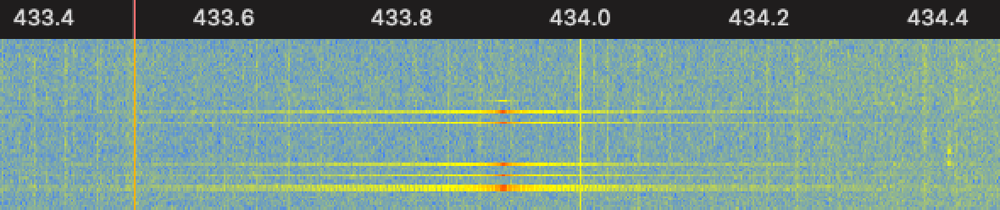
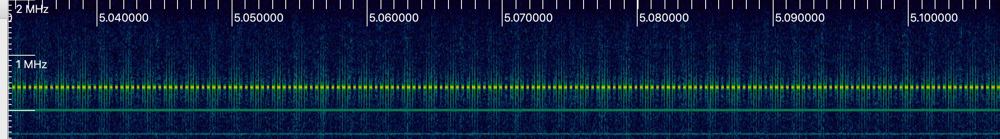
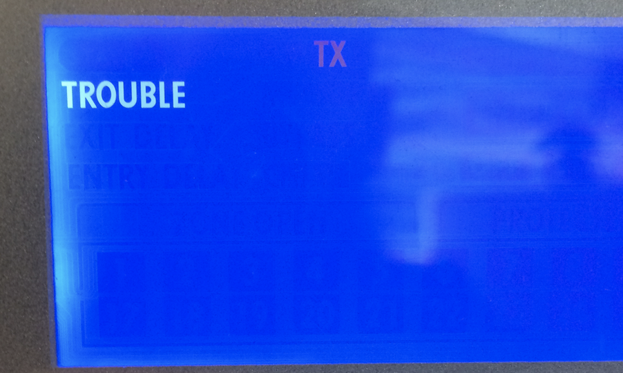
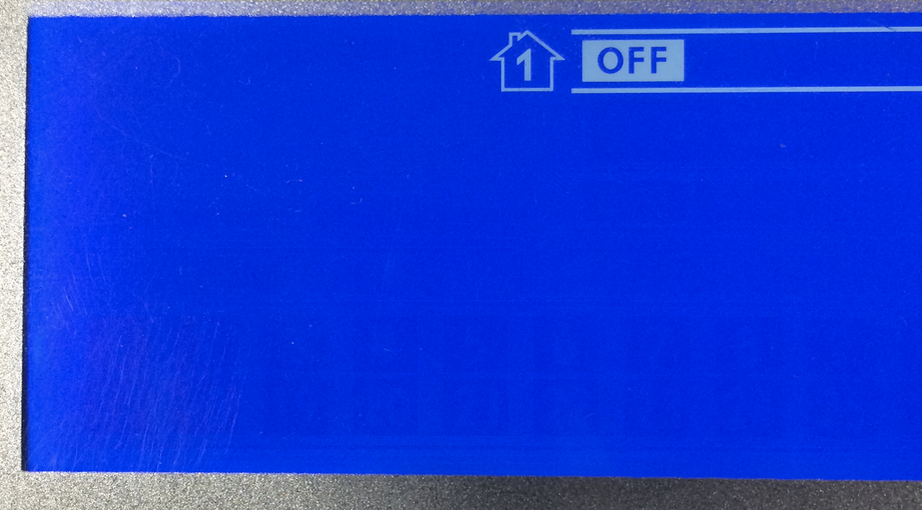

===============================
Smart alarms can be pretty dumb
===============================

:Date: 2019-03
:Author: @rfc6919
:Audience: BSides CBR 2019-03-15

*******
Caveats
*******

- I'm not talking about an IoT "Smart Alarm"
- I won't name the vendor or product
- Not really an "SDR" talk, radio is just the transport
- No live demo :(

*************
What and Why?
*************

- Security systems are interesting
- Let's look at an alarm
- Fixed-code systems are boring
- Let's look at something that's (hopefully) not entirely crap
- Black-box approach

******
Vendor
******

- Manufactured (or just assembled/packaged?) in North America
- Australian importer/distributor
- Alarm monitoring providers as resellers (also Amazon retailers, ofc)
- Small business/prosumer, not "secure site"
- I notice the keypads in retail, small offices

********
Hardware
********

Console
  Central unit in a lockable cabinet, siren, phone line, GSM/3G

Control panel/keypad/fob
  Arm/disarm, status display, end-user management

Sensors/sirens
  Motion, door/window, smoke, glassbreak, siren

************
Capabilities
************

- 2-way comms (remote units are Tx/Rx)
- Remote units require enrollment
- "RF Jamming Detection" ("TROUBLE!")

  .. image:: trouble.png
     :width: 700

- ISM/LIPD 433MHz and `868MHz <https://www.acma.gov.au/Industry/Suppliers/Product-supply-and-compliance/Commonly-supplied-equipment/wi-fi-bluetooth-and-other-low-powered-radiocommunications-transmitters>`_ (!)

Sounds reasonable, perhaps I won't get anywhere interesting without RE-ing the firmware.

****************
Initial RF Recon
****************

- 433.9MHz PWM ASK, 200µs/5kBd sub-symbol, 600µs/1.66kBd symbol
- Preamble: 4 on, 13 cycles of off/on, 2 off, 6 on, 2 off
- Data: 4 or 8 bytes of data ( 1=on/on/off, 0=on/off/off )
- Trailer: 1 final pulse on
- Preamble is *not* valid packet data
- Remotes just send if they've got something to say
- Console sends ~0.1s of on/off as a wakeup when it wants (possibly battery-powered) remotes to pay attention

.. image:: inspectrum-packet.png
   :width: 700

**************
Capturing Data
**************

- No fixed prefix in data payload: no sync word? (but the preamble has a well-defined end)
- luaradio bodge to capture on-air data (including signal strength), dump as json, then I can process/mangle with jq::

   {
     "timestamp":1535333985.1992,
     "raw_payload":"1111010101010101010101010101010011111100 ...110...100... 1",
     "signal_strength":0.19165825719635,
     "payload":"...1...0..."
   }

- Some common prefixes in payload, but too many to make sense as target address
- Small changes in payload function result in bit changes throughout payload data: no obvious command/address fields
  (eg: person A arm vs. disarm, or person A arm vs. person B arm)
- Not encrypted, but not enough data to identify command/data structure
- I observed 35 distinct data packets across a month of data collection

Perhaps this system isn't as good as I'd hoped. :(

*****************
Captures (1): BAU
*****************

Every ~4 minutes there's a wakeup, then a sequence of 8 packets taking ~2 seconds in total::

  {"t":"08:56:25","p3":"_WAKEUP_","a":"console","n":"WAKEUP"}
  {"t":"08:56:25","p3":"f1d80212","a":"console","n":"keepalive 1 ?"}
  {"t":"08:56:26","p3":"b5908232","a":"console","n":"keepalive 2 ?"}
  {"t":"08:56:26","p3":"b19a4236","a":"console","n":"keepalive 3 ?"}
  {"t":"08:56:26","p3":"f5d2c216","a":"console","n":"keepalive 4 ?"}
  {"t":"08:56:26","p3":"bdd122ca","a":"console","n":"keepalive 5 ?"}
  {"t":"08:56:27","p3":"9df0a2c0","a":"console","n":"keepalive 6 ?"}
  {"t":"08:56:27","p3":"b5f262c2","a":"console","n":"keepalive 7 ?"}
  {"t":"08:56:27","p3":"95d3e2c8","a":"console","n":"keepalive 8 ?"}
  {"t":"09:00:25","p3":"_WAKEUP_","a":"console","n":"WAKEUP"}
  {"t":"09:00:26","p3":"f1d80212","a":"console","n":"keepalive 1 ?"}
  {"t":"09:00:26","p3":"b5908232","a":"console","n":"keepalive 2 ?"}
  {"t":"09:00:26","p3":"b19a4236","a":"console","n":"keepalive 3 ?"}
  {"t":"09:00:27","p3":"f5d2c216","a":"console","n":"keepalive 4 ?"}
  {"t":"09:00:27","p3":"bdd122ca","a":"console","n":"keepalive 5 ?"}
  {"t":"09:00:27","p3":"9df0a2c0","a":"console","n":"keepalive 6 ?"}
  {"t":"09:00:27","p3":"b5f262c2","a":"console","n":"keepalive 7 ?"}
  {"t":"09:00:28","p3":"95d3e2c8","a":"console","n":"keepalive 8 ?"}

Every ~25 minutes the keypad transmits once and then gets some ACKs from the console::

  {"t":"04:40:07","p3":"5d18faef","a":"keypad1","n":"? keypad keepalive ?"}
  {"t":"04:40:07","p3":"7970ef6b","a":"console","n":"ack to keypad1 ?"}
  {"t":"04:40:07","p3":"7970ef6b","a":"console","n":"ack to keypad1 ?"}
  {"t":"05:05:32","p3":"5d18faef","a":"keypad1","n":"? keypad keepalive ?"}
  {"t":"05:05:32","p3":"7970ef6b","a":"console","n":"ack to keypad1 ?"}
  {"t":"05:05:32","p3":"7970ef6b","a":"console","n":"ack to keypad1 ?"}

Every ~20-40 minutes the sensor sends a series of constant packets::

  {"t":"08:12:17","p3":"cc90fbe0","a":"sensor1","n":"? battery OK ?"}
  {"t":"08:12:17","p3":"cc90fbe0","a":"sensor1","n":"? battery OK ?"}
  {"t":"08:12:18","p3":"cc90fbe0","a":"sensor1","n":"? battery OK ?"}
  {"t":"08:12:18","p3":"cc90fbe0","a":"sensor1","n":"? battery OK ?"}
  {"t":"08:12:18","p3":"cc90fbe0","a":"sensor1","n":"? battery OK ?"}
  {"t":"08:12:19","p3":"cc90fbe0","a":"sensor1","n":"? battery OK ?"}
  {"t":"08:12:19","p3":"cc90fbe0","a":"sensor1","n":"? battery OK ?"}
  {"t":"08:12:20","p3":"cc90fbe0","a":"sensor1","n":"? battery OK ?"}
  {"t":"08:31:50","p3":"cc90fbe0","a":"sensor1","n":"? battery OK ?"}
  {"t":"08:31:51","p3":"cc90fbe0","a":"sensor1","n":"? battery OK ?"}
  {"t":"08:31:51","p3":"cc90fbe0","a":"sensor1","n":"? battery OK ?"}
  {"t":"08:31:52","p3":"cc90fbe0","a":"sensor1","n":"? battery OK ?"}
  {"t":"08:31:52","p3":"cc90fbe0","a":"sensor1","n":"? battery OK ?"}
  {"t":"08:31:53","p3":"cc90fbe0","a":"sensor1","n":"? battery OK ?"}
  {"t":"08:31:53","p3":"cc90fbe0","a":"sensor1","n":"? battery OK ?"}
  {"t":"08:31:53","p3":"cc90fbe0","a":"sensor1","n":"? battery OK ?"}

********************
Captures (2): Motion
********************

While there's motion, the motion sensor sends a stream of packets every ~0.5s::

  {"t":"04:48:07","p3":"cc907b9a","a":"sensor1","n":"motion"}
  {"t":"04:48:08","p3":"cc907b9a","a":"sensor1","n":"motion"}
  {"t":"04:48:08","p3":"cc907b9a","a":"sensor1","n":"motion"}
  {"t":"04:48:08","p3":"cc907b9a","a":"sensor1","n":"motion"}
  {"t":"04:48:09","p3":"cc907b9a","a":"sensor1","n":"motion"}
  {"t":"04:48:09","p3":"cc907b9a","a":"sensor1","n":"motion"}
  {"t":"04:48:10","p3":"cc907b9a","a":"sensor1","n":"motion"}
  {"t":"04:48:10","p3":"cc907b9a","a":"sensor1","n":"motion"}
  {"t":"04:50:00","p3":"cc907b9a","a":"sensor1","n":"motion"}
  {"t":"04:50:01","p3":"cc907b9a","a":"sensor1","n":"motion"}
  {"t":"04:50:01","p3":"cc907b9a","a":"sensor1","n":"motion"}
  {"t":"04:50:02","p3":"cc907b9a","a":"sensor1","n":"motion"}
  {"t":"04:50:02","p3":"cc907b9a","a":"sensor1","n":"motion"}
  {"t":"04:50:02","p3":"cc907b9a","a":"sensor1","n":"motion"}
  {"t":"04:50:03","p3":"cc907b9a","a":"sensor1","n":"motion"}
  {"t":"04:50:03","p3":"cc907b9a","a":"sensor1","n":"motion"}
  {"t":"04:55:47","p3":"cc907b9a","a":"sensor1","n":"motion"}
  {"t":"04:55:48","p3":"cc907b9a","a":"sensor1","n":"motion"}
  {"t":"04:55:48","p3":"cc907b9a","a":"sensor1","n":"motion"}
  {"t":"04:55:49","p3":"cc907b9a","a":"sensor1","n":"motion"}
  {"t":"04:55:49","p3":"cc907b9a","a":"sensor1","n":"motion"}
  {"t":"04:55:49","p3":"cc907b9a","a":"sensor1","n":"motion"}
  {"t":"04:55:50","p3":"cc907b9a","a":"sensor1","n":"motion"}
  {"t":"04:55:50","p3":"cc907b9a","a":"sensor1","n":"motion"}

********************
Captures (3): Disarm
********************

::

  {"t":"22:43:31","p3":"3d788a6f        ","a":"keypad1","n":"? start arm/disarm sequence ?"}
  {"t":"22:43:31","p3":"7970ef6b        ","a":"console","n":"ack to keypad1 ?"}
  {"t":"22:43:31","p3":"7970ef6b        ","a":"console","n":"ack to keypad1 ?"}
  {"t":"22:43:31","p3":"7d70f8bdaf7dfd6f","a":"console","n":"??"}
  {"t":"22:43:31","p3":"5d3b6ae7        ","a":"keypad1","n":"? ack to console (arm/disarm, poweron) ?"}
  {"t":"22:43:31","p3":"393058bde5547f6f","a":"keypad1","n":"??? early op, some arm, some disarm, User1 ???"}
  {"t":"22:43:31","p3":"7d70f8bdaf7dfd6f","a":"console","n":"??"}
  {"t":"22:43:31","p3":"7970ef6b        ","a":"console","n":"ack to keypad1 ?"}
  {"t":"22:43:32","p3":"753878ddbdfcffed","a":"console","n":"??"}
  {"t":"22:43:32","p3":"5d3b6ae7        ","a":"keypad1","n":"? ack to console (arm/disarm, poweron) ?"}
  (repeat x 3)
  {"t":"22:43:32","p3":"7d1af8fdbffc7def","a":"console","n":null}
  {"t":"22:43:32","p3":"5d3b6ae7        ","a":"keypad1","n":"? ack to console (arm/disarm, poweron) ?"}
  (repeat x 1)
  {"t":"22:43:33","p3":"753878ddbdfcffed","a":"console","n":null}
  {"t":"22:43:33","p3":"5d3b6ae7        ","a":"keypad1","n":"? ack to console (arm/disarm, poweron) ?"}
  (repeat x 1)
  {"t":"22:43:33","p3":"5d3bf8d5bffcfde5","a":"console","n":null}
  {"t":"22:43:33","p3":"5d3b6ae7        ","a":"keypad1","n":"? ack to console (arm/disarm, poweron) ?"}
  (repeat x 1)
  {"t":"22:43:34","p3":"753878ddbdfcffed","a":"console","n":null}
  {"t":"22:43:34","p3":"5d3b6ae7        ","a":"keypad1","n":"? ack to console (arm/disarm, poweron) ?"}
  (repeat x 1)
  {"t":"22:43:40","p3":"3d7a78aeaf7dff6b","a":"console","n":null}
  {"t":"22:43:40","p3":"5d3b6ae7        ","a":"keypad1","n":"? ack to console (arm/disarm, poweron) ?"}
  (repeat x 1)
  {"t":"22:43:43","p3":"753878ddbdfcffed","a":"console","n":null}
  {"t":"22:43:43","p3":"5d3b6ae7        ","a":"keypad1","n":"? ack to console (arm/disarm, poweron) ?"}
  (repeat x 1)

*****************
Synthetic Disarms
*****************

Disarms are repeatable enough that I should be able to synthesise one. Simple, yeah?

- Collect a disarm
- Pretend I'm the keypad
- Spit pre-cooked packets at the console
- Win!

***********************************
Synthetic Disarms: sad_trombone.wav
***********************************

- No win :(

I couldn't make this work. Why not?

- Attribution to keypad/console isn't right?

  - Possible I guess?

- I'm missing some other communication channel?

  - Don't think so: couldn't find anything else in 433/868/902 or .au LIPD 915-928

- Interference from the real keypad trying to join the conversation

***********
Why Disarm?
***********

- Gets logged
- Alarm monitoring company earns their keep
- Someone gets a late-night phone call

****************
Alternatively...
****************

- Motion alert is a (per site? per sensor?) static packet
- Reflexive jamming!
- Watch for the distinctive start of one of these, when you see it jam until the end
- Needs *fast* turnaround between detection and jamming

  - 27ms packet, can identify in 12.8ms, need to turnaround in < 14.2ms

- I guess I'm writing CC1111 firmware now :(
- Assume different PIR sensors send different packets :(

*********************
Screw it, go low-rent
*********************

- Console heartbeat is every 4 minutes, like clockwork
- Trivially detectable (static pattern every time)
- What if we just jam everything whenever the watchdog isn't looking?

**************************
What's the time, Mr. Wolf?
**************************

::

  10 wait for heartbeat to complete
  20 jam for 230 seconds, loot the joint
  30 stand still
  40 goto 10

And you get 3m50s to do whatever you like, stand still for 10 seconds, and off you go again. But TROUBLE?

****************
Nope, no TROUBLE
****************

(caveat: possible low-battery warnings for keypad/sensors)

****
TODO
****

- Get a keypad (sorry Topaz 😢)
- Move keypad out of range, relay comms
- Dump keypad RAM/firmware, RE

*******
Finally
*******

- You don't need to be a DSP guru, there's lots of stuff running over simple radio transports
- Lots of it is pretty easy to mess with
- Alarm owner doesn't care: their threat is junkies looking for crap to sell, not ninja hackers

*********
Resources
*********

- Me

  - @rfc6919
  - github.com/rfc6919 <- sources will be here once I sanitize them
  - IRC: russm (#inspectrum, #hackrf, #rfcat, #kiwicon)

- sdr-australia.slack.com (DM @sdr_melbourne for invite, or find Pam around the con)
- Gqrx (http://gqrx.dk/)
- Inspectrum (https://github.com/miek/inspectrum)
- luaradio (http://luaradio.io/)
- Pothos (http://www.pothosware.com/)
